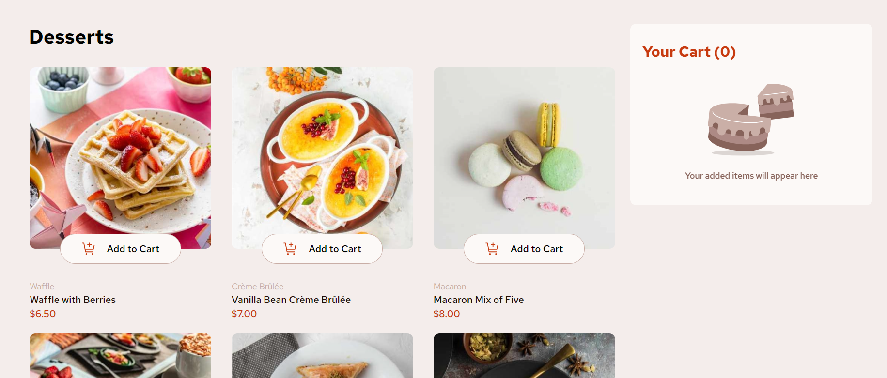
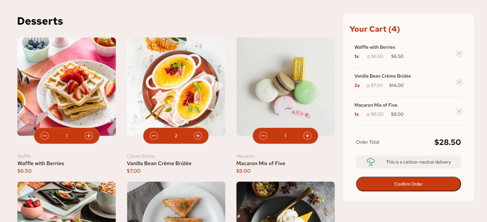
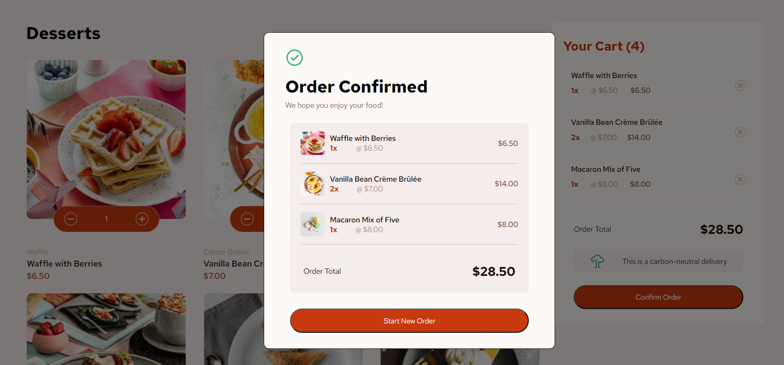

# Frontend Mentor - Product list with cart solution

This is a solution to the [Product list with cart challenge on Frontend Mentor](https://www.frontendmentor.io/challenges/product-list-with-cart-5MmqLVAp_d). Frontend Mentor challenges help you improve your coding skills by building realistic projects. 

## Table of contents

- [Overview](#overview)
  - [Screenshot](#screenshot)
  - [Links](#links)
- [My process](#my-process)
  - [Built with](#built-with)
  - [Useful resources](#useful-resources)
- [Author](#author)
- [Acknowledgments](#acknowledgments)

## Overview

### Screenshot

### Links

- Solution URL: [Solution URL](https://www.frontendmentor.io/solutions/product-list-with-cart-IuQcx0VmpS)
- Live Site URL: [Live site](https://alejandrvilla.github.io/product-list-with-cart/)

## My process

### Built with

- Semantic HTML5 markup
- CSS custom properties
- Flexbox
- CSS Grid
- Mobile-first workflow
- [React](https://reactjs.org/) - JS library

### Useful resources

- [Guide to Flexbox](https://css-tricks.com/snippets/css/a-guide-to-flexbox/) - Useful to learn about Flexbox.
- [Guide to CSS Grid](https://css-tricks.com/snippets/css/complete-guide-grid/) - Useful to learn about CSS Grid
- [HTML DOM](https://www.w3schools.com/jsref/prop_html_innerhtml.asp)
- [How to Deploy React on GitHub Pages?](https://medium.com/@swarajgosavi20/how-to-deploy-react-on-github-pages-33e427f0bd36)

## Author

- Website - [Alejandro Villa Herrera](https://www.linkedin.com/in/alejandro-villa-herrera-6b8780142)
- Frontend Mentor - [@AlejandrVilla](https://www.frontendmentor.io/profile/AlejandrVilla)
- Github - [@AlejandrVilla](https://github.com/AlejandrVilla)